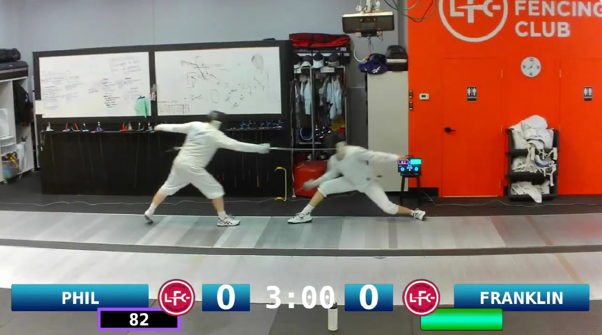

# **[LFC_Overlay_and_Camera_Tracking](https://github.com/BenKohn2004/LFC_Overlay_and_Camera_Tracking)**

This project is a recording and camera tracking solution consisting of two independent systems. The first part uses two quadrature encoders built into the Favero reels, and the second is a Raspberry Pi that receives Bluetooth Low Energy (BLE) data from a [Skewered Fencing](https://github.com/skewered-fencing) machine to create a scoring overlay for fencing match recordings.

**Camera Tracking**

**Reel Hardware**

An explanation of how the quadrature encoding works can be found in this [YouTube Video](https://youtu.be/cfHPRQ0f3-o) and an example of the result can be seen [here](https://youtu.be/vwvP2WLjDpE?t=64).

The tracking system uses quadrature encoding via a series of four [black matte vinyl wrap](https://www.amazon.com/dp/B07PYK74SG) ⅛-circle segments adhered to the bottom of the Favero reel drum. The other four ⅛-circle segments are left blank, as the bare aluminum is reflective enough on its own.

Two TCRT5000 infrared sensors are placed 32 mm apart and held in place by a [3D-printed holder](https://cad.onshape.com/documents/fab3dbb0c6cd24d122a26ac7/w/167803772a56f7a36cd09560/e/40a31ee80700d67aef5da61b?renderMode=0&uiState=6a9347b5703c2e93da4af6cf). They connect to a PCB using the provided [Gerber File](https://github.com/BenKohn2004/LFC_Overlay_and_Camera_Tracking/blob/main/Camera%20Tracking%20System/Gerber_Favero_Optical_Encoder_PCB_Favero_Optical_Encoder_2_2026-08-18.zip) and [Schematic](https://github.com/BenKohn2004/LFC_Overlay_and_Camera_Tracking/blob/main/Camera%20Tracking%20System/Schematic_Favero_Optical_Encoder_2026-08-30.pdf). These sensors are powered by and relay data back to the circuit board. The main components for the board are a [Wemos D1 Mini](https://www.amazon.com/NodeMcu-Internet-Development-ESP8266-Compatible/dp/B0BHW1CNCM/ref=sr_1_3) and a [0.96-inch OLED screen](https://www.amazon.com/iPistBit-Display-Luminous-Compatible-Raspberry/dp/B0D2NPB4BM/), along with a few 10kΩ resistors, 0.1 µF and 100 µF capacitors, [pushbuttons](https://www.amazon.com/dp/B00R17XUFC), and [terminal connectors](https://www.amazon.com/Molence-Terminal-Connector-Terminals-26-18AWG/dp/B09F6TC7RP/). For the 0.96-inch OLED, make sure that VCC and GND are in the correct order to match the PCB—there seem to be two common pinout styles, and one has the pins flipped.

The system also uses an [18650 battery](https://www.temu.com/18650-rechargeable-lithium-battery-for-home-use-2200mah-3-7v-high-cost-performance-ratio-g-601099981128259.html), a [TP4056 charging module](https://www.temu.com/12pcs--lithium-battery-charging-module-with-micro-usb-type-c-ports-protection-board-18650-charging-board-protection-module-g-606096320255275.html), a [battery holder](https://www.temu.com/10pcs-5pcs-18650-power-bank-cases-1x-3-6v-4-2v-18650-battery-holder-storage-box-case-1-slot-battery-container-with-wire-lead-g-601099751570278.html), and a [power switch](https://www.temu.com/30pcs--mini-toggle-switches-mini--toggle-switches-compact-high-knob-design-for--on---boards-g-601100638881014.html). Everything is enclosed in a [3D-printed case](https://cad.onshape.com/documents/7d9532982665e26a0dfa1674/w/e8c4ee4c5a7db918b2149cef/e/8ab91a05bc2fb4744dda546d?renderMode=0&uiState=6a934cc2d62aea1f596a2f0e) designed to screw into the back of the Favero reel using tapped, threaded holes for [8 mm M3 screws](https://www.temu.com/uadkl-347pcs--hex-socket-button-head-screws-nuts-assortment-kit-round--set-5-20mm-metric-machine-screws-with-storage-box-for-electronics-furniture-hardware-repair-g-607178903681949.html). The power switch is wired so that it can either charge the battery or power the circuit board. To power the circuit board directly during testing, simply plug USB power into the Wemos.

The servo is a [DS3218](https://www.amazon.com/dp/B07HNTKSZT) that sits atop a tripod and pans the [manual-focus USB camera](https://www.aliexpress.us/item/3256805987213806.html). The Wemos D1 Mini controlling the camera servo is wired directly without a PCB.

**Reel Coding**

The code for the reel Wemos can be found in [`Wemos_Reel_Encoder.ino`](https://github.com/BenKohn2004/LFC_Overlay_and_Camera_Tracking/blob/main/Camera%20Tracking%20System/Wemos_Reel_Encoder.ino). The Left vs. Right reel is configured by this line:

`outgoingData.senderID = 1; // 1 for Left, 2 for Right`

Change the value to `2` for the Right reel. The distance from the reel to the camera is assumed to be around 250. The units are arbitrary, but they are displayed on the OLED as the reel extends. You can stick with the default assumption, set it on power-up, or hardcode your preferred baseline by editing:

`int hypotenuse = 250;`

The code for the Camera Servo unit can be found in [`Wemos_Camera_Servo Rev 1.ino`](https://github.com/BenKohn2004/LFC_Overlay_and_Camera_Tracking/blob/main/Camera%20Tracking%20System/Wemos_Camera_Servo%20Rev%201.ino).

**Video Recording and Replay**

The video recording system is relatively straightforward and builds on the excellent work done by [Augusto Roman](https://github.com/skewered-fencing) in developing and sharing the Skewered Fencing box. The Skewered Fencing box broadcasts match data over BLE. The [Raspberry Pi](https://www.amazon.com/RasTech-Raspberry-Active-Cooler-Readers/dp/B0D2WYFS23/ref=sr_1_1) picks up the BLE signal and renders the data as a live overlay onto video captured from the plugged-in USB webcam. The Raspberry Pi uses a [touchscreen display](https://www.amazon.com/dp/B0D3QB7X4Z) and is powered by a portable [USB battery bank](https://www.amazon.com/dp/B0BJQ7F16T).

The Raspberry Pi triggers recordings automatically whenever scoring data changes (such as a light going off) and keeps recording for 5 minutes after the last light. It also automatically splits into a new bout whenever the score resets to 0 - 0. Fencer names and team logos are customizable, and bouts can be copied off the Pi using a USB flash drive.

The system works by continuously buffering footage and saving touch timestamps. If you export all bouts at once, it saves only the clipped touches. If you export a specific individual bout, it exports the entire continuous recording rather than just the touches.

It is currently designed for local recording rather than livestreaming, though it could be adapted for streaming without too much trouble.

The Raspberry Pi setup is tailored to what I find convenient, but the code is kept flexible so anyone can tweak it to fit their club's needs.

**Future Considerations**

The project is meant to be easily adaptable, and there is no expectation that everyone will keep the code completely standard. A few ideas I may explore later on:

**Livestreaming or Direct Uploading**  
Directly uploading from the Pi to YouTube or even running a live stream is entirely feasible. My main hesitation is that many tournament venues have poor, unreliable Wi-Fi. Recording locally and uploading later often yields much better video quality anyway, and few people mind if footage goes up a few hours later—most real-time updates are followed by parents and friends via [Fencing Time Live](https://www.fencingtimelive.com/).

**Favorites and Clip Review Tagging**  
Adding a quick bookmarking or favorites feature. Cycling through the "match count" or another rarely used remote button—or even briefly bumping a second onto the clock—could signal the Pi to tag that touch clip for instant review.

**Blade Contact and Waterfall Display**  
The Skewered Fencing machine supports blade contact detection and a waterfall display. There could be a clever way to integrate this telemetry directly into the video overlay.

**Audio and Sound Effects**  
Subtle suspense music when a bout reaches 4-4 or 14-14, or victory stingers when the winning touch lands (either automated or button-triggered).

Audio in general: there currently is no audio pipeline configured on the Raspberry Pi, mainly because I have not gotten around to adding it yet.
